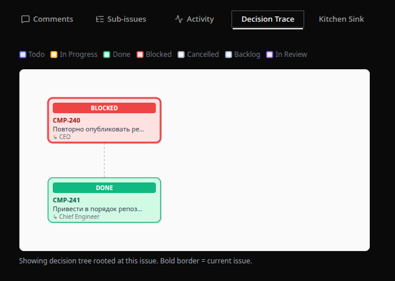

# Paperclip Decision Trace

A Paperclip plugin that visualises the issue/task decision tree for any issue in your company.
Given any issue identifier, it walks up to the root of the hierarchy and builds a full tree view — useful for tracing how decisions propagate from goals down to individual tasks.



## Features

- **`getIssueTree` action** — returns the full issue hierarchy rooted at the top-level ancestor of a given issue, with agent assignment info
- **`health` data handler** — returns plugin status and a timestamp

## API

### Action: `getIssueTree`

**Input**

| Field | Type | Description |
|-------|------|-------------|
| `issueId` | `string` | ID of the issue to trace |
| `companyId` | `string` | Company scope |

**Output**

```json
{
  "tree": {
    "id": "...",
    "identifier": "CMP-1",
    "title": "Root issue",
    "status": "in_progress",
    "priority": "high",
    "assigneeAgentId": "...",
    "assigneeAgentName": "Chief Engineer",
    "createdByAgentId": "...",
    "createdByAgentName": "...",
    "parentId": null,
    "children": [ ... ]
  },
  "rootId": "...",
  "targetId": "..."
}
```

The tree is capped at 4 levels of depth. Up to 200 issues from the same project are fetched to populate siblings.

### Data handler: `health`

Returns `{ status: "ok", checkedAt: "<ISO timestamp>" }`.

## Development

```bash
pnpm install
pnpm dev            # watch build
pnpm test           # run vitest suite
pnpm typecheck      # TypeScript check without emit
```

### Local SDK packages

SDK tarballs live in `.paperclip-sdk/` (gitignored) and are referenced via `pnpm.overrides` in `package.json`. This is intentional for local development. Before publishing the plugin, replace those `file:` references with published npm package versions once `@paperclipai/plugin-sdk` and `@paperclipai/shared` are available on the registry.

## Install into Paperclip

### Via Paperclip UI

1. Open your Paperclip company settings.
2. Navigate to **Plugins** in the sidebar.
3. Click **Install plugin**.
4. Enter the npm package name `paperclip-decision-trace` and confirm.
5. Once installed, the **Decision Trace** tab appears on every issue page.

### Via API (local path)

```bash
PLUGIN_DIR=$(pwd)
curl -X POST "${PAPERCLIP_API_URL:-http://127.0.0.1:3100}/api/plugins/install" \
  -H "Content-Type: application/json" \
  -d "{\"packageName\":\"$PLUGIN_DIR\",\"isLocalPath\":true}"
```

## Build options

- `pnpm build` — esbuild (fast, recommended)
- `pnpm build:rollup` — Rollup (alternative bundler)

Both use presets from `@paperclipai/plugin-sdk/bundlers`.

## License

MIT
